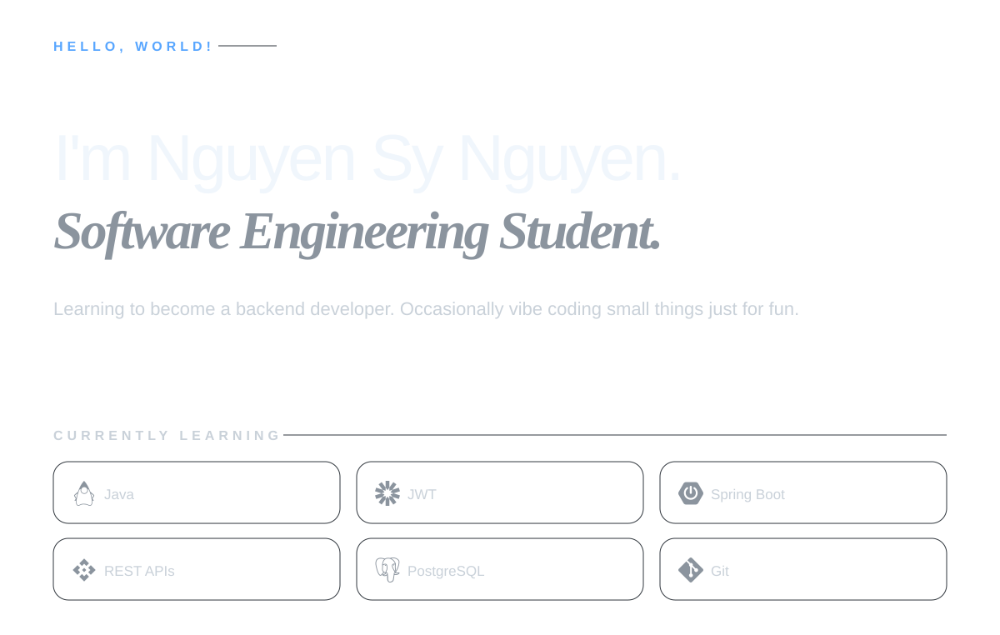

<!--
  AUTO-GENERATED FILE.
  Edit profile.json or scripts/generate_profile.py instead.
-->

<picture>
  <source media="(prefers-color-scheme: dark)" srcset="./assets/profile-dark.svg">
  <source media="(prefers-color-scheme: light)" srcset="./assets/profile-light.svg">
  
</picture>
